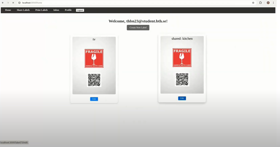

# MoveOut

This project focused on developing an application that can help people when they are moving houses. The application focuses on allowing users to create labels that they can put on their moving boxes. On the application a user can input either text, images or audio with the purpose of for example showing/descriping what the box contains. Each label will have a unique QR-code that a user can scan, when scanned they will be able to see the content that they inserted “into” the label.

# How to Use

## Prerequisites

Node.js: Download from nodejs.org

MySQL: This project uses a MySQL database hosted on DigitalOcean.

Database CA Certificate:
To securely connect to the DigitalOcean database, a CA certificate file is required. Ensure the certificate file is located in the designated folder within your project so that the database connection uses it securely.

### Ngrok

This project uses Ngrok to securely expose the local server to the internet. Ngrok is particularly helpful for testing features that require external access, such as scanning the QR code on a label with a mobile device to render its contents.

Install Ngrok: Download and install Ngrok from ngrok.com.

Start Ngrok: Run the following command to create a tunnel for your application (assuming it runs on port 3000): ngrok http 3000

Update URLs: Once Ngrok is running, it will provide a forwarding link (e.g., https://example.ngrok-free.app).

Replace any existing Ngrok links in the code with the new link. To update the links, do a project-wide search for "ngrok" and replace the URLs as needed.

### Environment Setup

Create a .env file in the root directory of your project with the following configuration to set up database connections and application settings:

Email configuration:

EMAIL_USER=your_email_address

EMAIL_PASS=your_email_password

Application base URL:

BASE_URL=your_base_url

Database configuration:

DB_HOST=your_database_host

DB_USER=your_database_user

DB_PASSWORD=your_database_password

DB_DATABASE=your_database_name

DB_PORT=your_database_port

In the path config/db/moveout.js the connection the database on DigitalOcean is setup.

The variables for in the .env file are related to the email that will be used to send emails with nodemailer. Go to nodemailer documentation to find more information if needed to understand how it works.

### Install Dependencies

After creating the .env file, run the following command in the project directory to install the necessary packages: npm install

## Test

To test the different parts of the system, manual testing can be performed by going through each component one at a time. For example, testing user authentication, label creation, and other functionalities.

## Run

To start the server, open the terminal in the root directory and run: node index.js

## License

This project is licensed under the MIT License.
